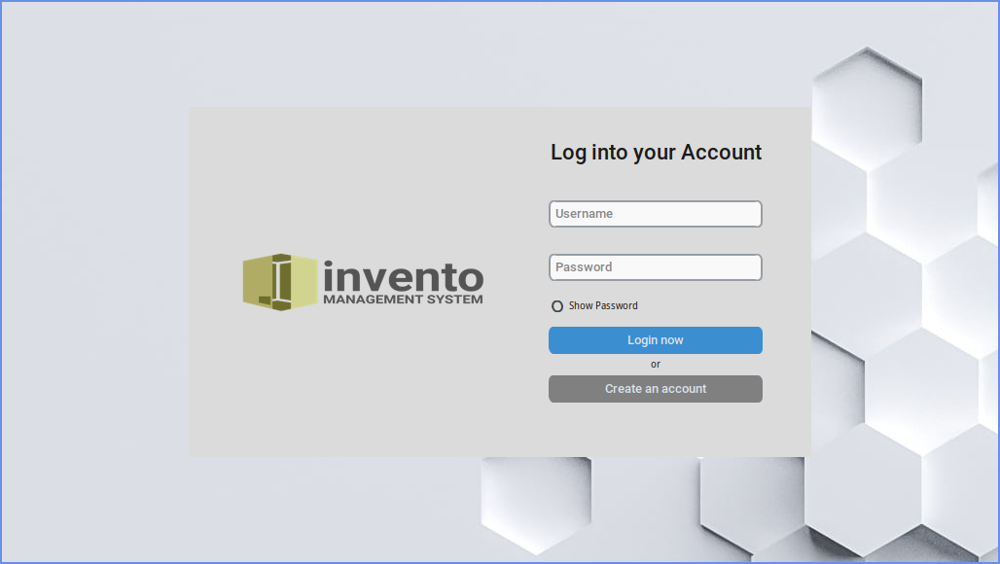
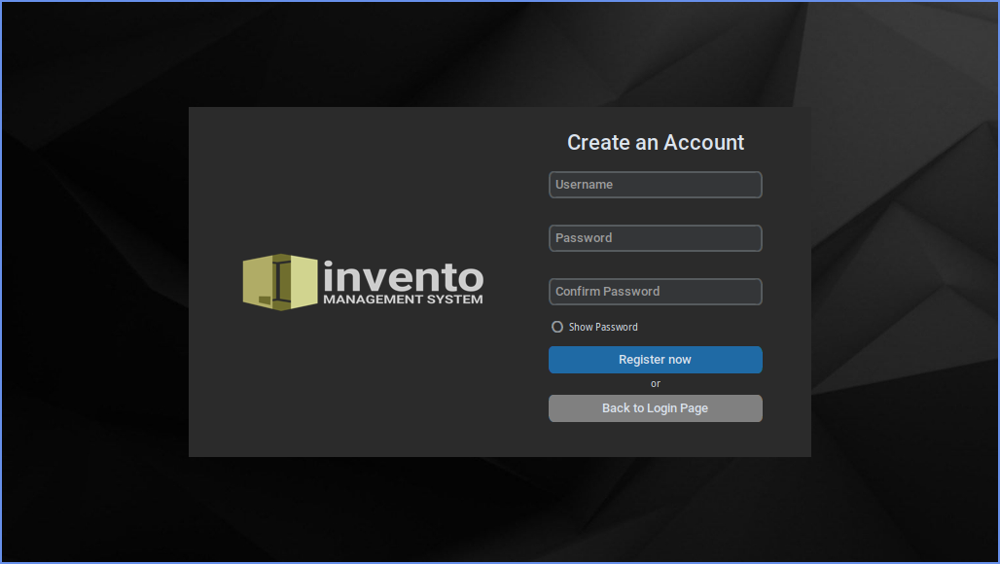
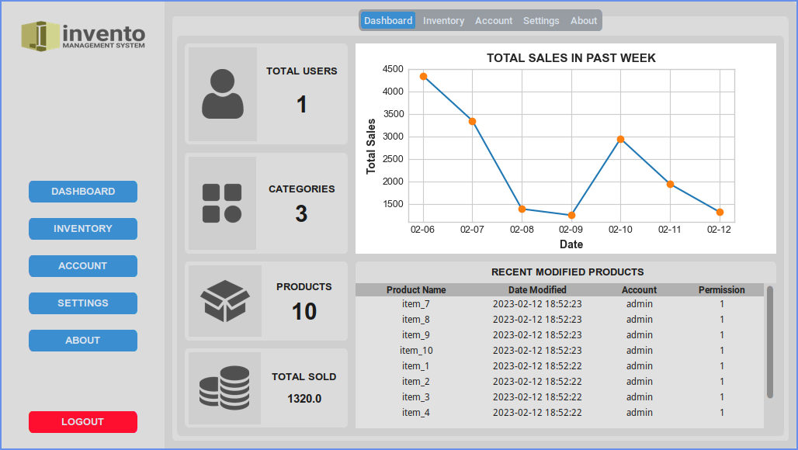
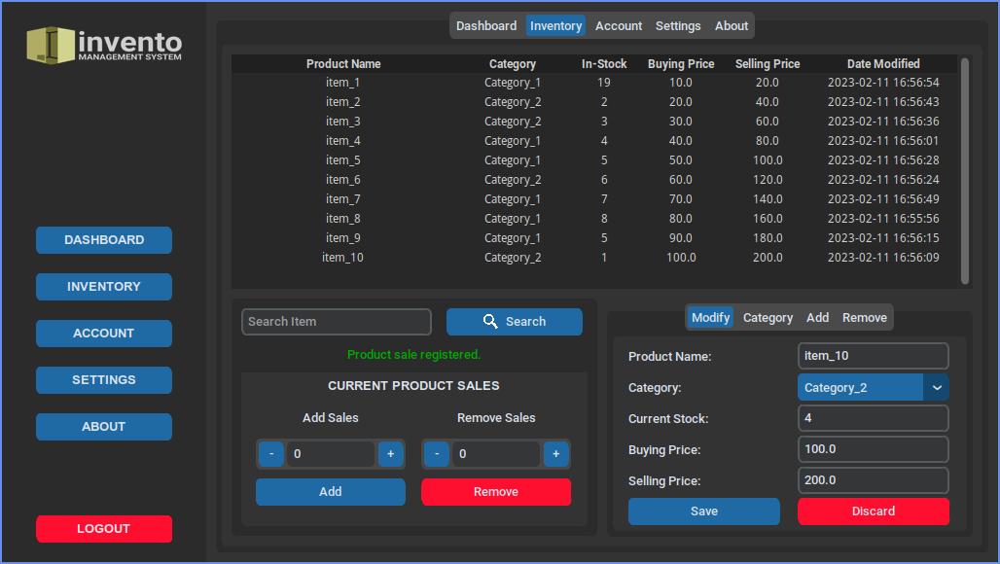
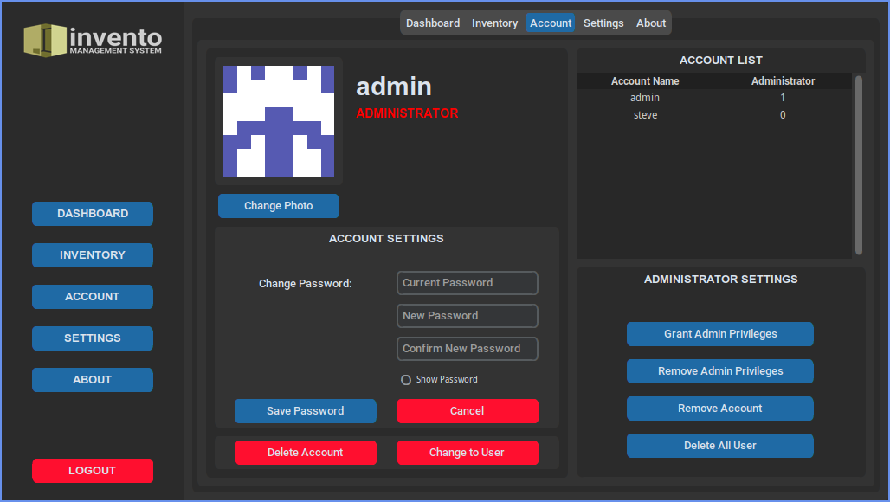

## :globe_with_meridians: Description

Inventory management system that tracks sales performance and inventory changes.
A project for Discrete Structures II.

## :camera: Screenshots

<details>
  <summary>Screenshots</summary>
    
    
    
    
    
</details>

## :gear: Features

### Core

- [x] Login system
- [x] Register user account
- [x] Administrator account
- [x] Add, modify, delete inventory items
- [x] Evaluate and modify current stock
- [x] Sort and filter on search inventory items
- [x] Calculate total sales per day
- [x] Show graph of sales per day

### Extras

- Generate account photo
- Theme changes
- Widget scaling

## :page_with_curl: Documentation

Click below to download the documentation or view its source code in `./doc/latex/Documentation_Invento.tex`.


## :clipboard: Setup Guide

### Prerequisites

- Requires Python 3.10.x
- Install `customtkinter`, `pillow`, and `matplotlib` via `pip install`

### Execution

1. Clone the repository to your machine and change directory to cloned project.

   ```sh
   git clone https://github.com/steguiosaur/invento.git && cd ./invento
   ```

2. Install the required dependencies.

   ```sh
   pip install -r requirements.txt
   ```

3. Execute `main.py` in `src/` folder to run the application.

   ```sh
   python main.py
   ```
